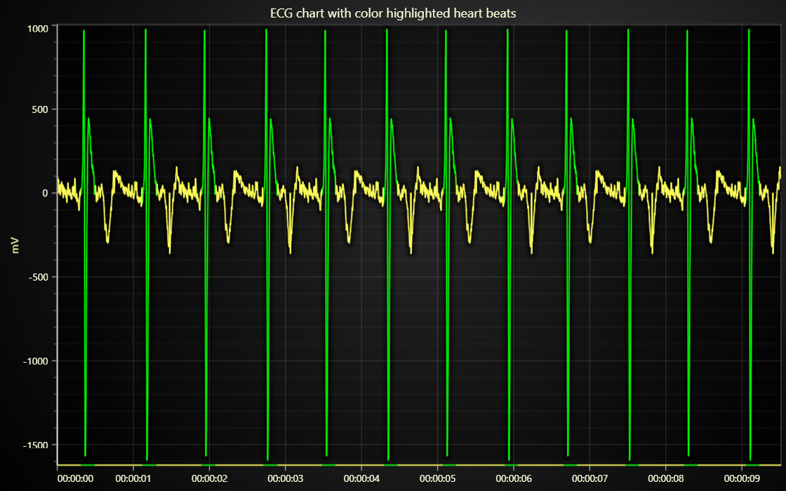

# JavaScript ECG Chart with Highlighted Beats

This demo application belongs to the set of examples for LightningChart JS, data visualization library for JavaScript.

LightningChart JS is entirely GPU accelerated and performance optimized charting library for presenting massive amounts of data. It offers an easy way of creating sophisticated and interactive charts and adding them to your website or web application.

The demo can be used as an example or a seed project. Local execution requires the following steps:

-   Make sure that relevant version of [Node.js](https://nodejs.org/en/download/) is installed
-   Open the project folder in a terminal:

          npm install              # fetches dependencies
          npm start                # builds an application and starts the development server

-   The application is available at _http://localhost:8080_ in your browser, webpack-dev-server provides hot reload functionality.

## Description

Example that showcases `LineSeries` feature for coloring line dynamically based on X coordinates.

In this example, there is a ECG data set (voltage measurements from a heart over short period of time).
This data is visualized as a _Line Chart_ where X dimension represents _time_ and Y dimension measured _voltage_.

This is a very traditional and well known setting, but this example adds a little twist to it in order to showcase the dynamic X coloring feature.

The example code automatically detects heart beats from the data set and tracks the X coordinate intervals that contain active heart beats.

[//]: # 'IMPORTANT: The assets will not show before README.md is built - relative path is different!'

This heart beat information is then used to prepare a _Value - Color lookup table_, a conceptually simple object that can be widely used with many different LightningChart JS components.

The lookup table associates a range of _Values_ with corresponding _Colors_. In this example, this means defining the X value ranges which should be colored "normally" and ranges which should be colored in "highlighted" manner.

[//]: # 'IMPORTANT: The assets will not show before README.md is built - relative path is different!'

Dynamic line coloring is a powerful feature which can serve many different needs. The best thing about it is that it doesn't compromise performance, meaning that you can use it just as well with 100 data points or 100 million data points.

In addition to dynamic coloring by X coordinate there are also more dynamic coloring modes available:

-   [Line dynamic coloring by Y coordinates](https://lightningchart.com/lightningchart-js-interactive-examples/examples/lcjs-example-0051-linePaletteY.html)
-   [Line dynamic coloring by separate Value data set](https://lightningchart.com/lightningchart-js-interactive-examples/examples/lcjs-example-0052-linePaletteValue.html)

## API Links

* [Chart XY]
* [Axis]
* [Line series]
* [Axis tick strategies]
* [Paletted fill]
* [Color lookup table]
* [Color RGBA]

## Support

If you notice an error in the example code, please open an issue on [GitHub][0] repository of the entire example.

Official [API documentation][1] can be found on [LightningChart][2] website.

If the docs and other materials do not solve your problem as well as implementation help is needed, ask on [StackOverflow][3] (tagged lightningchart).

If you think you found a bug in the LightningChart JavaScript library, please contact sales@lightningchart.com.

Direct developer email support can be purchased through a [Support Plan][4] or by contacting sales@lightningchart.com.

[0]: https://github.com/Arction/
[1]: https://lightningchart.com/lightningchart-js-api-documentation/
[2]: https://lightningchart.com
[3]: https://stackoverflow.com/questions/tagged/lightningchart
[4]: https://lightningchart.com/support-services/

© LightningChart Ltd 2009-2022. All rights reserved.

[Chart XY]: https://lightningchart.com/js-charts/api-documentation/v7.0.1/classes/ChartXY.html
[Axis]: https://lightningchart.com/js-charts/api-documentation/v7.0.1/classes/Axis.html
[Line series]: https://lightningchart.com/js-charts/api-documentation/v7.0.1/classes/LineSeries.html
[Axis tick strategies]: https://lightningchart.com/js-charts/api-documentation/v7.0.1/variables/AxisTickStrategies.html
[Paletted fill]: https://lightningchart.com/js-charts/api-documentation/v7.0.1/classes/PalettedFill.html
[Color lookup table]: https://lightningchart.com/js-charts/api-documentation/v7.0.1/classes/LUT.html
[Color RGBA]: https://lightningchart.com/js-charts/api-documentation/v7.0.1/functions/ColorRGBA.html

